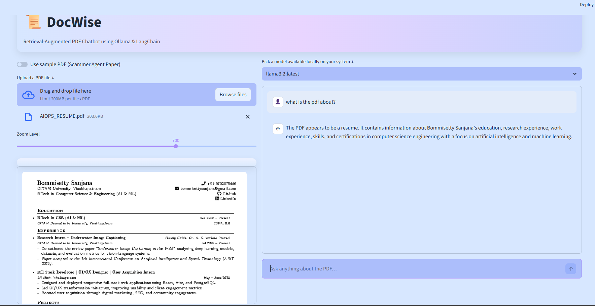

# DocWise — Retrieval-Augmented PDF Chatbot using Ollama & LangChain

DocWise is a **privacy-first, fully local PDF question-answering application** built using **Ollama** and **LangChain**.  
It allows users to upload PDF documents and interact with them conversationally using **Retrieval-Augmented Generation (RAG)** — without relying on any external APIs.

---

## 🧠 Key Highlights

- 🔒 **Fully local & private** — no data leaves your machine
- 📄 Upload PDFs and ask natural language questions
- 🔍 Semantic search using vector embeddings
- 🤖 Local LLM inference powered by Ollama
- 🖥️ Clean, pastel-themed Streamlit UI
- ⚡ Multi-query retrieval for improved answer relevance

---

## 🖼️ Application Layout



---

## 🚀 Features

- PDF ingestion and text extraction
- Intelligent text chunking for long documents
- Vector embeddings using `nomic-embed-text`
- Semantic retrieval with ChromaDB
- Multi-query retriever to improve context matching
- Local LLM response generation (Llama 3.x)
- Interactive chat interface with chat history
- Zoomable in-app PDF viewer
- Option to use sample PDF for quick testing

---

## 🛠️ Tech Stack

- **Programming Language:** Python  
- **Frontend:** Streamlit  
- **LLM Runtime:** Ollama  
- **LLM Models:** Llama 3.x  
- **Embeddings:** nomic-embed-text  
- **Framework:** LangChain  
- **Vector Database:** ChromaDB  
- **PDF Processing:** pdfplumber, UnstructuredPDFLoader  

---

## 🧩 How It Works

1. User uploads a PDF document  
2. Text is extracted and split into manageable chunks  
3. Each chunk is converted into vector embeddings  
4. Embeddings are stored in a local ChromaDB vector store  
5. User asks a question in natural language  
6. Multiple reformulated queries retrieve the most relevant chunks  
7. Ollama LLM generates a response strictly from retrieved context  

---

## ⚙️ Installation & Setup

### Prerequisites
- Python **3.10+**
- Ollama installed and running  
  👉 https://ollama.com

### Clone the repository
```bash
git clone https://github.com/sanjana970/DocWise--Retrieval-Augmented-PDF-Chatbot-using-Ollama-LangChain.git
cd DocWise--Retrieval-Augmented-PDF-Chatbot-using-Ollama-LangChain
